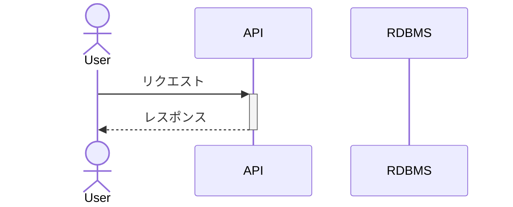

# API名称

## 機能概要

- API の機能概要を記載します。
- API の機能概要を記載します。
- API の機能概要を記載します。

## シーケンス

```mermaid
sequenceDiagram
    actor user as User
    participant api as API
    participant rdb as RDBMS

    user ->>+ api : リクエスト
    api -->>- user : レスポンス
```

## 処理詳細

### 1. ◯◯の取得

### 2. △△の取得

### 3. レスポンスの作成

## Appendix

- その他補足事項を記載します。
