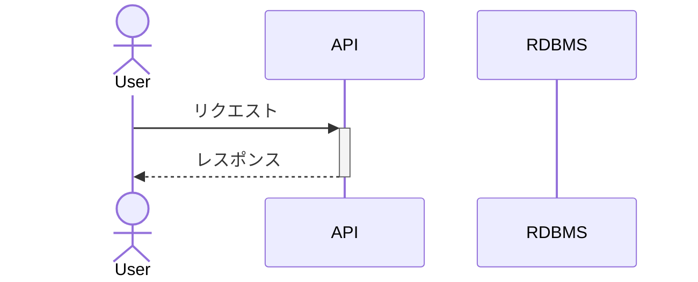

# API名称

## 機能概要

このAPIは、特定の機能を提供するためのエンドポイントを提供します。

## リクエスト

- メソッド: POST
- URL: /api/demo-clean-architecture/v1.0/example
- コンテンツタイプ: application/json

### リクエストボディ

```json
{
  "parameter1": "value1",
  "parameter2": "value2"
}
```

| フィールド名 | 型     | 必須 | 説明           |
| ------------ | ------ | ---- | -------------- |
| parameter1   | string | はい | パラメータ1    |
| parameter2   | string | いいえ | パラメータ2  |

## レスポンス

- ステータスコード: 200 OK
- コンテンツタイプ: application/json

### レスポンスボディ

```json
{
  "result": "success",
  "data": {
    "field1": "value1",
    "field2": "value2"
  }
}
```

| フィールド名 | 型     | 説明           |
| ------------ | ------ | -------------- |
| result       | string | 処理結果       |
| data         | object | データオブジェクト |

## エラーハンドリング

- ステータスコード: 400 Bad Request
  - 説明: リクエストボディのバリデーションエラー
  - レスポンスボディ:
    ```json
    {
      "code": "INVALID_PARAMETER",
      "message": "Invalid parameter"
    }
    ```

- ステータスコード: 401 Unauthorized
  - 説明: 認証エラー
  - レスポンスボディ:
    ```json
    {
      "code": "UNAUTHORIZED",
      "message": "Unauthorized Error"
    }
    ```

- ステータスコード: 500 Internal Server Error
  - 説明: サーバー内部エラー
  - レスポンスボディ:
    ```json
    {
      "code": "INTERNAL_ERROR",
      "message": "Internal Server Error"
    }
    ```

## シーケンス



## 処理詳細

### 1. ◯◯の取得

### 2. △△の取得

### 3. レスポンスの作成

## Appendix

- その他補足事項を記載します。
